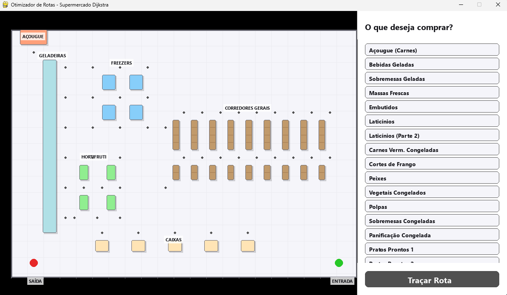
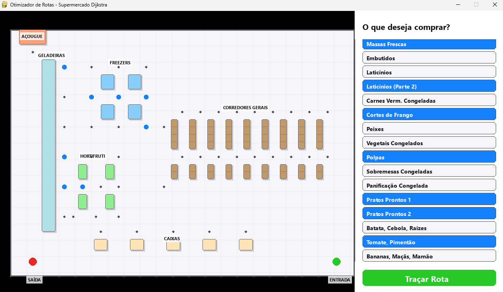
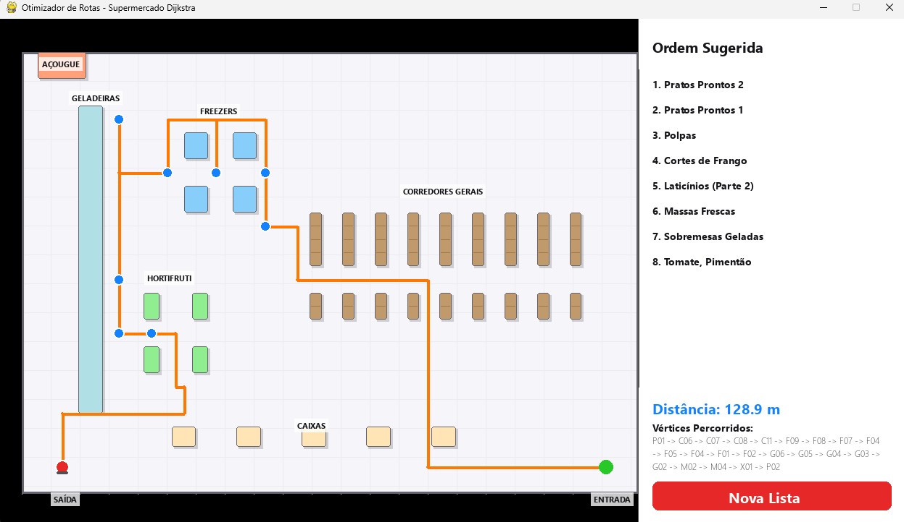

# Otimizador de Trajeto em Supermercado (Supermercado Dijkstra)

**Número da Lista**: 35<br>
**Conteúdo da Disciplina**: Grafos <br>

## Alunos

| Matrícula | Aluno |
| -- | -- |
| 241025425 | Vinícius Araújo Oliveira |
| 221022480 | Carlos Henrique de Paiva Munis |

## Sobre

Este projeto tem como objetivo otimizar a rota de um cliente dentro de um supermercado, reduzindo o deslocamento físico necessário para coletar todos os itens de uma lista de compras. O mercado foi modelado como um grafo ponderado, onde os nós representam seções (açougue, corredores, caixas, etc.) e as arestas representam a distância em metros entre eles

O sistema funciona dividindo o problema em duas partes:
1. **Cálculo de Caminhos Mínimos:** O **Algoritmo de Dijkstra** é utilizado para calcular a menor distância real entre qualquer par de nós no mercado.
2. **Ordenação da Rota (TSP):** Como encontrar a rota globalmente ótima para múltiplos pontos é um problema NP-difícil (Problema do Caixeiro-Viajante), o projeto adota a heurística do **Vizinho Mais Próximo (Nearest Neighbor)**. Partindo da posição atual, o algoritmo sempre direciona o cliente para o item não visitado mais próximo, construindo uma rota aproximada e eficiente em tempo hábil.

A visualização do trajeto é feita na interface gráfica utilizando a técnica de roteamento ortogonal, garantindo que o percurso sugerido desvie organicamente das prateleiras e estruturas do mercado.

## Screenshots

*(Nota: Adicione as imagens reais na pasta `assets/` do seu repositório e substitua os links abaixo)*


*Figura 1: Interface de seleção de produtos com catálogo rolável.*


*Figura 2: Elementos selecionados no mapa*


*Figura 3: Conclusão do percurso exibindo a distância total em metros e os vértices visitados.*

## Instalação

**Linguagem:** Python 3.8+<br>
**Framework:** Pygame<br>

**Pré-requisitos e Comandos:**
Certifique-se de ter o Python instalado na sua máquina. Siga os passos abaixo no terminal:

1. Clone este repositório:
```bash
git clone [https://github.com/seu-usuario/G35_Grafos_PA-26.2.git](https://github.com/seu-usuario/G35_Grafos_PA-26.2.git)
cd G35_Grafos_PA-26.2

# Windows:
python -m venv venv
venv\Scripts\activate

# Linux/Mac:
python3 -m venv venv
source venv/bin/activate

pip install pygame

python src/interface/mapa_interativo.py